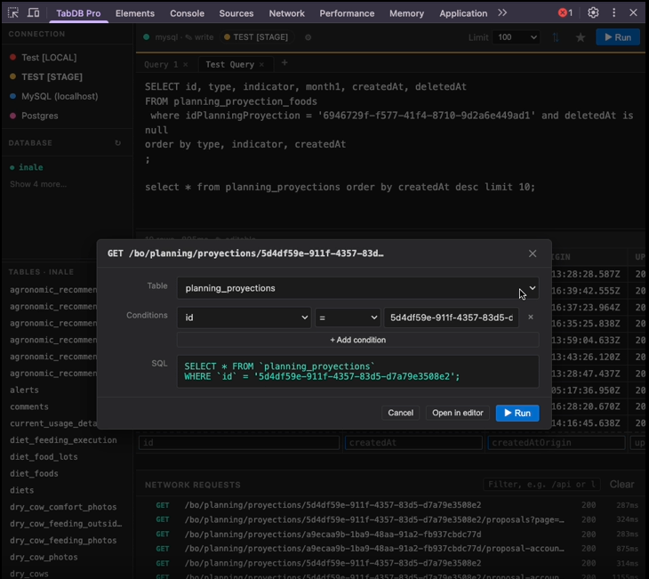

# TabDB Pro

**Query, browse and edit your MySQL or PostgreSQL database without leaving Chrome DevTools.**

No external app. No context switching. Your database lives right next to your console and network inspector.

🌐 **[Landing page](https://fabcam.github.io/TabDBPro)**

[](https://fabcam.github.io/TabDBPro)

```
Chrome DevTools Panel  →  Local Bridge (Node.js)  →  Your Database
     (SQL editor)            localhost:47321          MySQL / PostgreSQL
```

---

## Features

- **Zero context switching** — lives inside Chrome DevTools, where you already are
- **Network → SQL converter** — click any captured XHR/fetch request to instantly generate a WHERE-clause query based on the URL params and path segments
- **SSH tunnel support** — connect to remote databases through a bastion host; TOFU host-key verification (no manual `known_hosts` setup)
- **Inline cell editing** — click any cell to edit it; changes commit with a real `UPDATE`
- **Insert rows** — sticky insert row at the bottom of every result table
- **FK navigation** — arrow buttons on foreign key columns jump to the related record in a new tab, following the relationship chain
- **Multi-connection support** — switch between MySQL and PostgreSQL connections on the fly; last used connection restored automatically on reopen
- **Encrypted connection sharing** — export any subset of connections (including SSH keys) to an AES-256-GCM encrypted `.tabdbpro` file; teammates import it with a passphrase
- **Per-connection color & read-only mode** — assign a color to each connection, lock production, keep dev editable
- **Schema browser** — full database / table tree in the sidebar with double-click to query
- **Saved queries** — star any query, name it, load it in one click
- **Query history** — last 50 queries, restored with a click
- **Multi-tab editor** — open parallel queries in tabs, close with `Alt+W`
- **Resizable panels** — drag to resize every pane
- **Dark / light theme** — follows your OS preference automatically
- **No `.env` required** — all connection config lives in the extension UI and is pushed to the bridge at runtime

---

## Requirements

- Node.js 18+
- Chrome (or any Chromium-based browser)
- PostgreSQL and/or MySQL running locally

---

## Setup

### 1. Start the bridge

```bash
cd bridge
npm install
npm start
```

The bridge starts on `http://localhost:47321`. No `.env` file needed — you configure connections from the extension UI.

> If you prefer to pre-configure connections via a file, copy `.env.example` to `.env` and fill it in. The bridge reads it on startup if present.

### 2. Load the extension in Chrome

1. Go to `chrome://extensions`
2. Enable **Developer mode** (toggle in the top-right corner)
3. Click **Load unpacked** and select the `extension/` folder from this repo
4. Open DevTools on any tab (`F12` or right-click → Inspect)
5. Click the **TabDB Pro** tab

The status dot in the toolbar turns green when the bridge is reachable. If no connections are configured, the Settings modal opens automatically.

### 3. Add a connection

Click the **⚙ Settings** button, then **Add connection**. Fill in your database details and click **Apply**. The bridge receives the config and connects immediately.

#### Share connections with teammates

Click **Export…** in the Settings footer to export connections as an encrypted `.tabdbpro` file:

1. Select which connections to include (checkboxes, with dot color and host shown)
2. Set a passphrase (AES-256-GCM · PBKDF2 · 200 000 iterations)
3. Download the file — share it via any channel (Slack, Drive, email)
4. Share the passphrase separately (Signal, phone call)

Teammates click **Import…**, select the file and enter the passphrase. Connections with the same name are updated; new ones are appended. SSH private keys stored in the extension are included in the export.

#### SSH tunnel (optional)

Check **Connect via SSH tunnel** to route the connection through a bastion host. Fields:

| Field | Description |
|---|---|
| SSH Host | Hostname or IP of the bastion server |
| SSH Port | Default `22` |
| SSH User | Unix user on the bastion |
| Key | Click **Browse…** to pick your private key file from disk, or type the path (`~` expands to your home directory) |
| Passphrase | Only if the key is passphrase-protected |

Use **Test SSH** to verify the tunnel before saving, and **Test connection** to do a full end-to-end DB ping through the tunnel.

**TOFU host verification** — on first connection the server's key fingerprint is stored in `bridge/data/known_hosts.json`. Subsequent connections verify it automatically. If the key ever changes (and you expect it to), delete that file or the relevant entry.

---

## Using the panel

### Sidebar

| Area | Behaviour |
|---|---|
| **Connection** | Only visible when multiple connections are configured. Click to switch. |
| **Database** | Lists all databases. Active one shown first; click **Show N more…** to expand the rest. |
| **Tables** | Single-click to highlight; double-click to run `SELECT *` in a new tab. Right-click for context menu. |
| **Saved** | Click to open a saved query. Hover to reveal the delete button. |

### SQL editor

| Shortcut | Action |
|---|---|
| `Ctrl+Enter` / `Cmd+Enter` | Run statement at cursor |
| Select text + `Ctrl+Enter` | Run selected text only |
| `Ctrl+S` / `Cmd+S` | Save current query |
| `Alt+W` | Close active tab |
| `Tab` | Insert 2 spaces |

### Results panel

- Sticky column headers with **click-to-sort** (asc → desc → original)
- **FK navigation** — `↗` button on foreign key columns opens related rows in a new tab
- Row count and execution time shown in the meta bar

### Write mode (per connection)

Enable in Settings by unchecking **Read-only** for the connection. When active, each result cell is editable — click to edit inline. A sticky insert row appears at the bottom.

Special insert values: `NULL`, `now()`, `uuid()`, and any `fn()` are injected as raw SQL expressions, not as strings.

### Network → SQL

Click **⇅** in the toolbar to open the network panel. It captures all XHR/fetch requests made by the inspected page.

Click any request → a modal shows the auto-generated `SELECT` query built from the URL structure:
- Path segments are matched against table names
- `/by-something/value` → `WHERE something_id = value`
- Query string params → extra `WHERE` conditions
- Field names are refined against the actual table columns

Edit conditions in the modal, then click **▶ Run** or **Open in editor**.

---

## Security

- **Bound to `127.0.0.1`** — not reachable from the network
- **CORS restricted** — only accepts requests from `devtools://` and `chrome-extension://` origins
- **Read-only by default** — blocks `INSERT`, `UPDATE`, `DELETE`, `DROP`, and other write statements
- **Two-layer read-only enforcement** — keyword blocklist + `SET default_transaction_read_only = on` at the PostgreSQL transaction level
- **No credentials in the browser** — the extension never sees your database password

---

## Bridge API

```
GET  /health                    Bridge status and DB connectivity
GET  /connections               List named connections and the active one
POST /connections/:name/use     Switch active connection
POST /configure                 Push connection config from the extension
GET  /databases                 List databases in the active connection
POST /databases/:name/use       Switch active database
GET  /tables                    List tables in the active database
GET  /tables/:name              Column schema for a table
GET  /tables/:name/indexes      Indexes and foreign keys for a table
POST /query                     Execute a SQL query
POST /test/ssh                  Test SSH tunnel connectivity (no DB involved)
POST /test/db                   Test full DB connection (with tunnel if configured)
```

---

## Project structure

```
TabDB Pro/
├── bridge/                         Node.js bridge service
│   ├── src/
│   │   ├── server.js               Fastify app entry point
│   │   ├── config.js               Config loader — parses .env or POST /configure payload
│   │   ├── db/
│   │   │   ├── pool.js             Connection pool — tracks active connection/database
│   │   │   ├── query.js            Query execution with read-only enforcement
│   │   │   ├── schema.js           Databases / tables / columns / indexes introspection
│   │   │   └── tunnel.js           SSH tunnel with TOFU host-key verification
│   │   ├── routes/
│   │   │   ├── health.js
│   │   │   ├── query.js
│   │   │   ├── configure.js        POST /configure — receives config from extension
│   │   │   ├── schema.js           Connections, databases, tables, indexes routes
│   │   │   └── test.js             POST /test/ssh and /test/db — connectivity checks
│   │   └── security/
│   │       └── guard.js            SQL keyword blocklist + localhost enforcement
│   ├── .env.example
│   └── package.json
│
├── extension/                      Chrome Extension (Manifest V3)
│   ├── manifest.json
│   ├── devtools/
│   │   ├── devtools.html           DevTools bootstrap page
│   │   └── devtools.js             Registers the panel
│   └── panel/
│       ├── panel.html
│       ├── panel.js                Main application logic
│       ├── style.css               Dark + light theme (prefers-color-scheme)
│       └── components/
│           ├── bridge.js           HTTP client for the bridge API
│           ├── connection-selector.js  Named connection switcher
│           ├── schema.js           Database and table sidebar tree
│           ├── editor-tabs.js      Multi-tab SQL editor
│           ├── results.js          Results table — read and write modes, FK nav
│           ├── saved-queries.js    Saved query management
│           ├── history.js          Query history (localStorage)
│           ├── network-requests.js Network capture + URL → SQL converter
│           ├── settings.js         Connection config UI
│           ├── resize.js           Drag-to-resize panels
│           └── context-menu.js     Right-click menu for table items
│
└── docs/                           GitHub Pages landing page
    └── index.html
```

---

## Roadmap

- [ ] Syntax highlighting (CodeMirror 6)
- [ ] Export results as CSV / JSON
- [ ] DELETE row from results (write mode)
- [ ] Auto-detect project database config from the inspected page

---

## Contributing

Issues and PRs are welcome. The project has no build step — the extension runs plain ES modules directly in Chrome, and the bridge is plain Node.js.

---

## License

MIT
